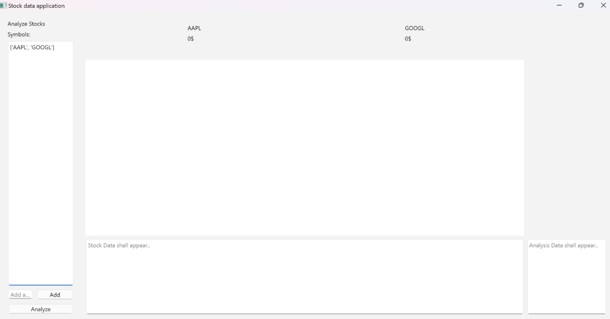

## Ohjelman Käynnistys

Ensiksi, asenna riippuvuudet komennolla:

```bash
poetry install
```

sitten käynnistä sovellus komennolla:

```bash
poetry run invoke start
```

Osake applikaatio Käyttöohje:




Oikeassa alakulmassa olevaa analyze nappia painamalla:

Saa uusinta osakedataa osake markkinoilta -5 UTC ajalta. 


Sovelluksessa ollaan laitettu Applen ja Googlen osake vakio osakkeiksi aloitus näkymään.
Kuten huomaat, osakkeista löytyy dataa alemmista laatikoista sekä pylväskaavio osakkeiden hinnoista.


Laittamalla hiiren näiden laatikoiden sisälle, voit vierittää alaspäin analyysin sivua ja siten saada “enemmän” irti analyysi teksteistä.


Voit myös lisätä uuden osakkeen, kunhan osaat laittaa oikean virallisen osake “symboli nimen”. Jos laitat nimen, jota ei löydy “osake-lyhenne” nimistä, niin silloin tekstikenttä tyhjentyy hetken kuluttua ja uutta osaketta ei lisätä. 


Muunnoin painamalla Add:

Applikaatio lisää osakkeen ylärimaan, ja painamalla uudestaan Analyze nappulaa saat sen mukaan pylväskaavioon ja muihinkin tekstilaatikkoihin. 

 


